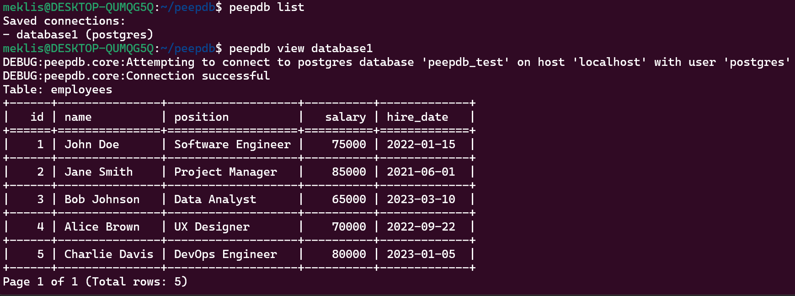

# peepDB

**peepDB** is an open-source command-line tool and Python library designed for developers and database administrators who need a fast and efficient way to inspect their database tables without writing SQL queries. With support for MySQL, PostgreSQL, MariaDB, MongoDB and SQLite. peepDB is lightweight, secure, and incredibly easy to use.

## 🚀 Features

- **Multi-Database Support**: Works with MySQL, PostgreSQL, MariaDB, MongoDB and SQLite.
- **Quick Data Inspection**: View all tables or a specific table with a simple command.
- **User-Friendly CLI**: Easy-to-use command-line interface powered by Click.
- **Secure Local Storage**: Securely store database connection details with encryption on your local machine.
- **Lightweight**: Minimal footprint, designed for speed.
- **Formatted Output**: View data in a clean, formatted table or JSON format.
- **Pagination**: Efficiently handle large datasets by viewing data in manageable chunks.

## 🎬 peepDB in Action

Here's a quick demonstration of peepDB:


## 🖼️ peepDB stills



> **Note:** The above image reflects the commands used in the official release (v0.1.3)

## 📦 Installation

You can install peepDB directly from PyPI:

```bash
pip install peepdb
```

## 🛠️ Usage

peepDB uses a command-based structure for easier and more intuitive use. Here are the main commands with examples:

### 1. Save Your Database Connection Details

For SQLite:
```bash
peepdb save mydb --db-type sqlite --host /path/to/mydb.sqlite --database mydb
```

For other databases:
```bash
peepdb save <connection_name> --db-type [mysql/postgres/mariadb/mongodb] --host <host> --user <user> --password <password> --database <database>
```

**Important Note on Password Handling:**
The password is required as a command-line argument. While this is convenient for scripting, it's important to note that this method can be insecure as the password may be visible in your command history or to other users who can view your screen or process list.

Example:
```bash
peepdb save myapp_db --db-type mysql --host localhost --user root --password my_secure_password --database myapp
```

For improved security, consider using environment variables or a configuration file to store sensitive information like passwords.

### 2. List Saved Connections

```bash
peepdb list
```

Example output:
```
Saved connections:
- myapp_db (mysql)
- analytics_db (postgres)
```

### 3. View Tables

View all tables:
```bash
peepdb view <connection_name>
```

View a specific table:
```bash
peepdb view <connection_name> --table <table_name>
```

Example:
```bash
peepdb view myapp_db --table users
```

Output:
```
Table: users
+----+----------+----------------------+
| id | username |        email         |
+====+==========+======================+
|  1 | johndoe  | johndoe@example.com  |
|  2 | janedoe  | janedoe@example.com  |
+----+----------+----------------------+
Page 1 of 1 (Total rows: 2)
```

### 4. Pagination

Use pagination to handle large datasets:
```bash
peepdb view <connection_name> --table <table_name> --page <page_number> --page-size <rows_per_page>
```

Example:
```bash
peepdb view myapp_db --table users --page 2 --page-size 50
```

### 5. Choose Output Format

Get output in JSON format:
```bash
peepdb view <connection_name> --format json
```

Example:
```bash
peepdb view myapp_db --table users --format json
```

Output:
```json
{
  "users": {
    "data": [
      {"id": 1, "username": "johndoe", "email": "johndoe@example.com"},
      {"id": 2, "username": "janedoe", "email": "janedoe@example.com"}
    ],
    "page": 1,
    "total_pages": 1,
    "total_rows": 2
  }
}
```

### 6. Remove Saved Connections

Remove a specific connection:
```bash
peepdb remove <connection_name>
```

Remove all connections:
```bash
peepdb remove-all
```

## 🔒 Security

peepDB implements several security measures to protect your database connection details:

1. **Local Storage**: All connection details are stored locally on your machine, not on any remote servers.
2. **Encryption**: Connection details are encrypted before being stored, using the cryptography library.
3. **Caution with Passwords**: While passwords are accepted as command-line arguments for convenience, users should be cautious about using this method in shared environments or situations where command history might be accessible to others.

## 🤝 Contributing

Contributions to peepDB are welcome! Please refer to our [Contributing Guide](CONTRIBUTING.md) for more information.

## 📜 License

Distributed under the GNU General Public License Version 3. See the [LICENSE](LICENSE) file for more details.

## 📚 Documentation

For more detailed documentation, please visit our [GitHub Pages](https://peepdb.dev/).
