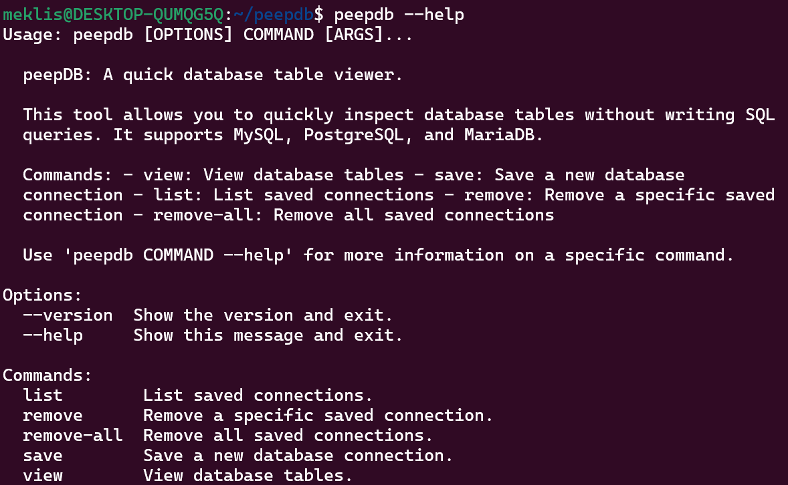

# peepDB

**peepDB** is an open-source command-line tool and Python library designed for developers and database administrators who need a fast and efficient way to inspect their database tables without writing SQL queries. With support for MySQL, PostgreSQL, and MariaDB, peepDB is lightweight, secure, and incredibly easy to use.

## 🚀 Features

- **Multi-Database Support**: Works with MySQL, PostgreSQL, and MariaDB.
- **Quick Data Inspection**: View all tables or a specific table with a simple command.
- **User-Friendly CLI**: Easy-to-use command-line interface powered by Click.
- **Secure Local Storage**: Securely store database connection details with encryption on your local machine.
- **Lightweight**: Minimal footprint, designed for speed.
- **Formatted Output**: View data in a clean, formatted table or JSON format.
- **Pagination**: Efficiently handle large datasets by viewing data in manageable chunks.

## 🎬 peepDB in Action

Here's a quick demonstration of peepDB:


## 🖼️ peepDB stills



> **Note:** The above images reflect the commands used in the official release (v0.1.3)

## 📦 Installation

You can install peepDB directly from PyPI:

```bash
pip install peepdb
```

**Requirements:**
- Python 3.6 or higher
- pip (Python package installer)

> **Note:** If peepdb gives an error like "The term 'peepdb' is not recognized as the name of a cmdlet" remember to add the Python Scripts folder to your PATH in Windows.

## System Dependencies

Before installing peepdb, ensure you have the following system dependencies:

```bash
sudo apt-get update
sudo apt-get install libmariadb3 libmariadb-dev
```

Verify the installation by running:
```bash
peepdb --version
```

## 🛠️ Usage

peepDB uses a command-based structure for easier and more intuitive use. Here are the main commands:

### 1. Save Your Database Connection Details

```bash
peepdb save <connection_name> --db-type [mysql/postgres/mariadb] --host <host> --user <user> --database <database>
```
You'll be prompted securely for the password.

### 2. List Saved Connections

```bash
peepdb list
```

### 3. View Tables

View all tables:
```bash
peepdb view <connection_name>
```

View a specific table:
```bash
peepdb view <connection_name> --table <table_name>
```

### 4. Pagination

Use pagination to handle large datasets:
```bash
peepdb view <connection_name> --table <table_name> --page <page_number> --page-size <rows_per_page>
```

### 5. Choose Output Format

Get output in JSON format:
```bash
peepdb view <connection_name> --format json
```

### 6. Remove Saved Connections

Remove a specific connection:
```bash
peepdb remove <connection_name>
```

Remove all connections:
```bash
peepdb remove-all
```

For more detailed usage information on any command, use the `--help` option:
```bash
peepdb <command> --help
```

## 👨‍💻 For Developers

Please refer to our [Contributing Guide](CONTRIBUTING.md) for information on setting up the development environment, running tests, and contributing to peepDB.

## 🔒 Security

peepDB implements several security measures to protect your database connection details:

1. **Local Storage**: All connection details are stored locally on your machine, not on any remote servers.
2. **Encryption**: Connection details are encrypted before being stored, using the cryptography library.
3. **Secure Password Input**: Passwords are never shown in plain text and are input securely.

However, please note that while we strive to implement best security practices, peepDB's security has not been verified by a third party. Users should exercise caution and follow general security best practices when using any tool that handles sensitive information.

The encryption key is stored in your user directory (~/.peepdb/key.key). Keep this key safe and do not share it.

## 📜 License

Distributed under the GNU General Public License Version 3. See the [LICENSE](LICENSE) file for more details.

## 📚 Documentation

For more detailed documentation, please visit our [GitHub Pages](https://peepdb.dev/).
